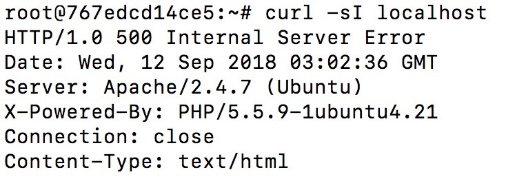
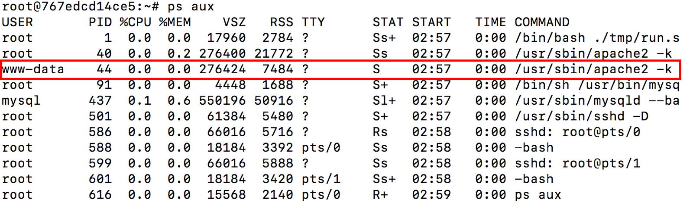
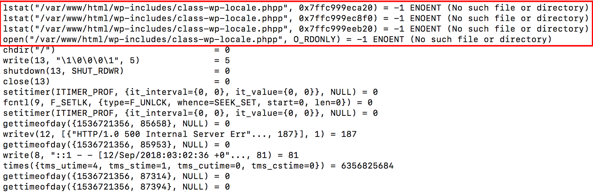
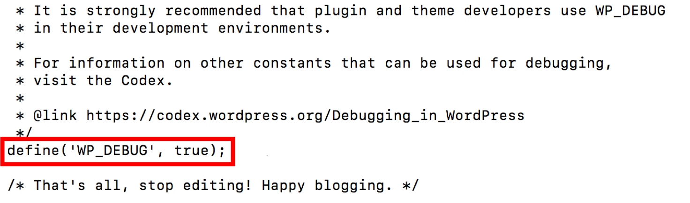
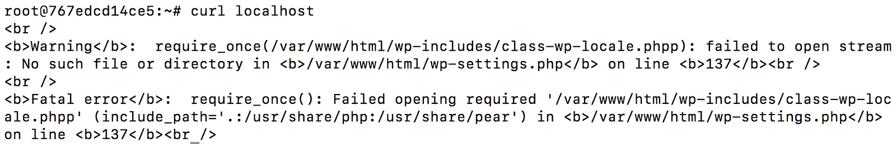
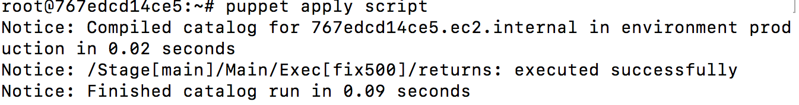
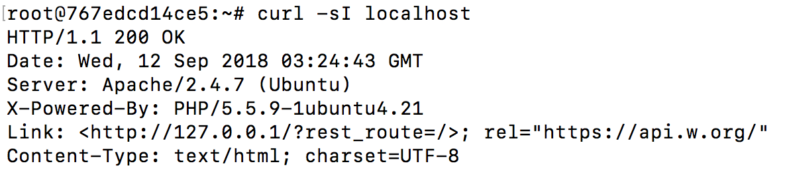
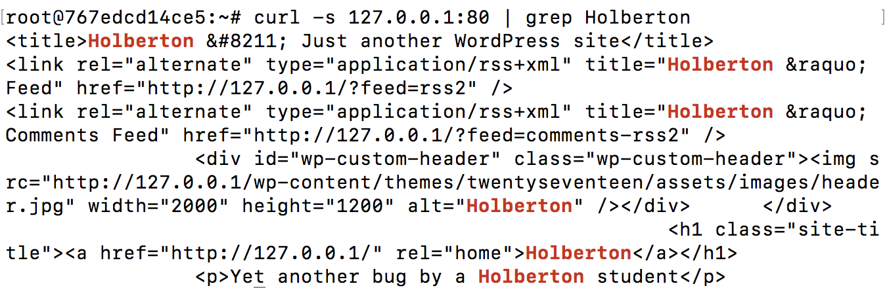

0x19. Postmortem
My first postmortem

A practice evaluation of a debugging task
Summary

A Wordpress website running on a LAMP stack returned a 500 Internal Server Error during 0900–1300 PST on Sept. 11, 2018. 100% of users were unable to access the website from their end. The main cause was a typo in the /var/www/html/wp-settings.php file.
Timeline

0900 - First user report of 500 error while attempting to access website on Chrome web browser. Confirmed error by running curl -sI localhost.

1000 - Diagnosed problem by checking the running processes and system calls for the www-data user's (default user for apache2) apache2 process using theps aux and strace commands, respectively.

1030 - curl localhost ran in a separate window to display the strace results below. Discovered a typo in a php filename from one of the php script files.

1100 - Turned on debug mode in the /var/www/html/wp-config.php file to examine all php scripts.

1115 - curl localhost ran again and displayed the following results:

1116 - Discovered typo on line 137 of the /var/www/html/wp-settings.php file:

require_once(/var/www/html/wp-includes/calss-wp-locale.phpp)

should be

require_once(/var/www/html/wp-includes/calss-wp-locale.php)

1200 - Wrote a puppet script that replaces the erroneous string with the correct string. Executed script to implement changes.

1215 - curl localhost to check status of GET request. Request returned a 200 HTTP status code and website content was confirmed.

1300 - Submitted script. Case closed.
Root cause

Typo on line 137 of /var/www/html/wp-settings.php:

require_once(/var/www/html/wp-includes/calss-wp-locale.phpp)

should be

require_once(/var/www/html/wp-includes/calss-wp-locale.php)
Resolution

    Wrote puppet script to utilizes the bash command sed to replace the erroneous string with the correct string.

Corrective/preventive measures

    Turn on debug mode in /var/www/html/wp-config.php prior to deploying website to check script functionality. This will allow our engineers to identify and fix errors prior to site deployment, which would improve customer satisfaction.
    Check host metrics in SumoLogic to confirm site activity: no site activity would provide a big clue in this case.
    Check that the web server is up and running and monitor the uptime.
    Monitor the request and response rates to ensure that the website is never too slow, otherwise users would leave for faster options.
    Monitor traffic and load on CPU.
    Identify the idle threads and less popular webpages so that developers, content writers, UI/UX designers, etc can improve the website interface, content, and functionality to attract a larger audience.
